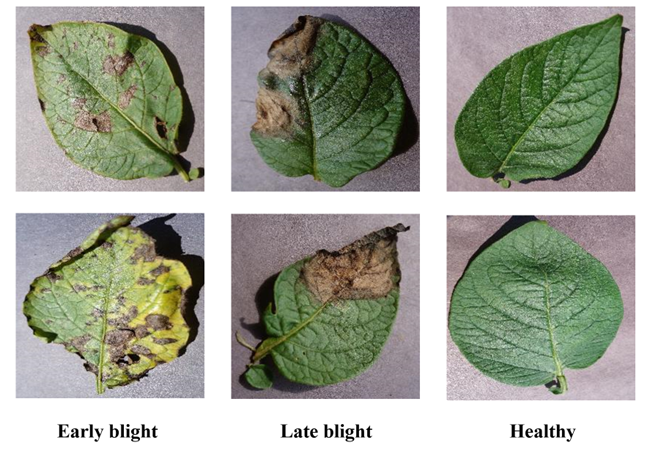
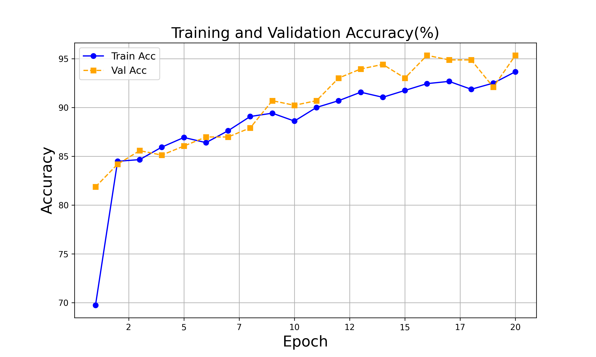
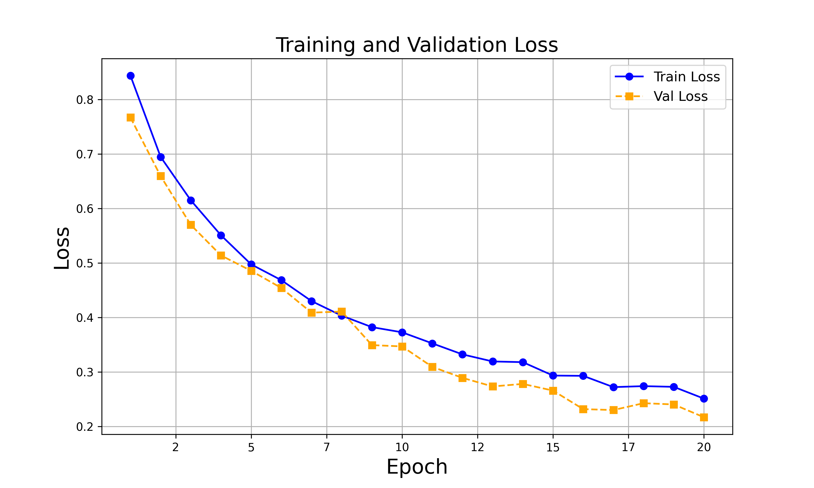
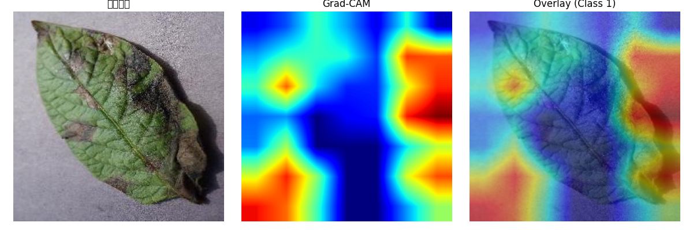

# Potato Leaf Disease Classification

Computer vision project for classifying potato leaf images into three classes:
early blight, late blight, and healthy. The project uses transfer learning with
ResNet50 and includes Grad-CAM visualizations to inspect model attention on
misclassified leaves.

## Project Highlights

- Built a three-class potato leaf disease classifier using PyTorch and ResNet50.
- Used ImageNet transfer learning with a frozen convolutional backbone and a
  task-specific fully connected classification head.
- Applied image augmentation and normalization for training.
- Evaluated model performance on a held-out test split.
- Used Grad-CAM to visualize regions that influenced model predictions.

## Dataset

The project uses a potato leaf disease dataset from Kaggle/PlantVillage. The
local dataset used for this project contains:

| Class | Images |
| --- | ---: |
| `Potato___Early_blight` | 1,000 |
| `Potato___Late_blight` | 1,000 |
| `Potato___healthy` | 152 |



Raw image data is not committed to this repository. To reproduce the project,
place the dataset in:

```text
data/PotatoPlants/
  Potato___Early_blight/
  Potato___Late_blight/
  Potato___healthy/
```

## Method

The pipeline uses an 80/10/10 train-validation-test split with a fixed random
seed. Training images are randomly resized, cropped, horizontally flipped, and
normalized with ImageNet statistics. Validation and test images use deterministic
resize and center crop transforms.

The model is a ResNet50 classifier:

1. Load ResNet50 with ImageNet weights when available.
2. Freeze the convolutional backbone.
3. Replace the final fully connected layer with a 3-class classification head.
4. Train the classification head with cross-entropy loss and Adam.

Model checkpoints are intentionally excluded from GitHub because they are large
binary artifacts.

## Results

The accuracy is **98.15%**.

### Accuracy



### Loss



### Grad-CAM Misclassification Examples



## Repository Structure

```text
.
|-- assets/
|   |-- accuracy.png
|   |-- dataset_samples.png
|   |-- loss.png
|   |-- gradcam_misclassified_1.png
|   |-- gradcam_misclassified_2.png
|   `-- gradcam_misclassified_3.png
|-- data/
|   `-- .gitkeep
|-- notebooks/
|   `-- potato_leaf_disease_classification.ipynb
|-- src/
|   |-- train.py
|   |-- evaluate.py
|   `-- gradcam.py
|-- .gitignore
|-- LICENSE
|-- README.md
`-- requirements.txt
```

## Setup

Create an environment and install dependencies:

```bash
pip install -r requirements.txt
```

Train the model:

```bash
python src/train.py --data-dir data/PotatoPlants --epochs 20
```

Evaluate the best checkpoint:

```bash
python src/evaluate.py --data-dir data/PotatoPlants --checkpoint outputs/best_model.pth
```

Generate a Grad-CAM overlay:

```bash
python src/gradcam.py \
  --image data/PotatoPlants/Potato___Late_blight/example.jpg \
  --checkpoint outputs/best_model.pth \
  --output assets/example_gradcam.png
```
